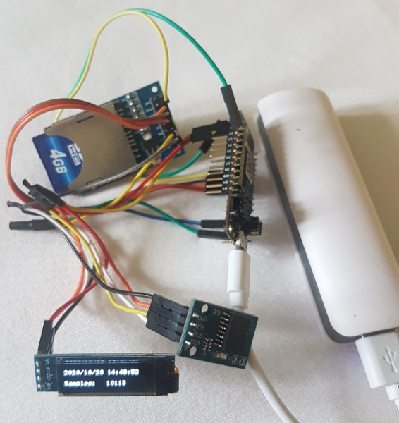
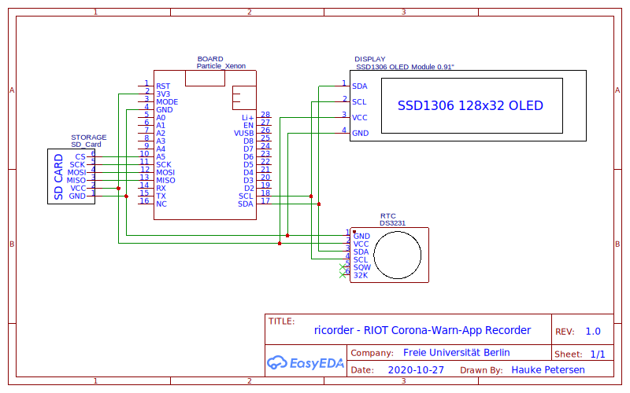

# ricorder - RIOT Corona-Warn-App Recorder

`ricorder` is a lightweight, standalone Bluetooth Low Energy (BLE) advertising
data scanner build for analyzing the real-world usage of the Corona-Warn-App. It
consist of a micro-controller running [RIOT](https://riot-os.org) that
permanently scans the BLE advertising channels and writes all detected packets
to a SD card.

The RAW data obtained by the scanner is then analyzed to gain insides into the
real-world deployment situation of the Corona-Warn-App.

This repository contains all information and software needed to build a
standalone Bluetooth Low Energy (BLE) scanner with inexpensive of-the-shelf
components. The repository also contains the basic tooling needed to analyze the
RAW data.


## Technical Details

Devices with an active Corona-Warn-App continuously transmit BLE advertising
packets as defined by the [Google/Apple Exposure Notification]
(https://blog.google/documents/70/Exposure_Notification_-_Bluetooth_Specification_v1.2.2.pdf)
framework. These packets can distinctly identified by their 16-bit service UUID
(0xFD6F) included in their payload.


## Log Format

The scanner will continuously write all received advertising packets to its SD
card. Before usage, the SD must be formatted with a FAT file system.

The scanner will create a new logfile every hour. The names of the logfiles are
directly deducted from the current timestamp: `filename := str(unixtime / 1000)`.
The shortening of the unixtime is hereby needed as the vfat module in RIOT seems
to have a restriction on 8 character long file names...

Each detected advertising packet is then appended to the current logfile as one
line using the following format:
```
TS_SEC.TS_MSEC;EVT_TYPE;ADDR_TYPE;ADDR;RSSI;AD
```
with:
- `TS_SEC`: unix timestamp in seconds of the time the packet was received
- `TS_MSEC`: sub-second value of the RX time
- `EVT_TYPE`: HCI event, using:
  - ADV_IND = 0
  - DIR_IND = 1
  - SCAN_IND = 2
  - NONCONN_IND = 3
  - SCAN_RSP = 4
- `ADDR_TYPE`: BLE address type, using:
  - PUBLIC = 0
  - RANDOM = 1
  - RPA_PUBLIC = 2
  - RPA_RANDOM = 3
- `ADDR`: 48-bit BLE address
- `RSSI`: received signal strength of that packet
- `AD`: the RAW received payload (advertising data), hex-encoded. All multi-byte
        data in this field is encoded little-endian. So e.g. if you want to find
        the exposure notification 16-bit UUID (0xFD6F) you have to look for
        0x6FFD.


## Hardware

The first prototype is build from the following components:
- [particle-xenon](https://docs.particle.io/datasheets/discontinued/xenon-datasheet/) (nrf52840 SoC including BLE radio and antenna)
- RTC module (DS3231) incl. CR1220 backup battery
- 0.92" OLED display (SSD1306, 128x32)
- Arduino SD card module
- SD card
- a couple of jumper wires
- USB power bank



**Pin Mapping:**



SD-Card Adapter:
```
module  board   CPU
VCC     3V3     -
GND     GND     -
MOSI    D12     P1.13
MISO    D11     P1.14
SCK     D13     P1.15
CS      A5      P0.31
```

RTC (DS3231):
```
module  board   CPU
VCC     3V3     -
GND     GND     -
SCL     SCL     P0.27
SDA     SDA     P0.26
```

OLED Display (SSD1306):
```
module  board   CPU
VCC     3V3     -
GND     GND     -
SCL     SCL     P0.27
SDA     SDA     P0.26
```


## Software

The firmware of the scanner is based on RIOT. It is located in the `/app`
directory of this repository.

The firmware application is structured into the following modules:
- `stor`: storage -> initializing and writing to the SD card
- `ui`: user interface -> initializing and feeding the OLED display
- `wallclock`: time keeping -> initializing and querying the RTC module
- `nimble_scanner` (part of RIOT): control NimBLE to do the actual BLE scanning
- `main`: glue all the modules together and run a low-prio thread that triggers
          updating the UI and writing the scan buffer to the SD card


## Tooling

The `/tools` directory of this repository contains some Python scripts that can
be used for analyzing the recorded log files. All of the scripts require a list
of logfiles as input, e.g.
`python3 join.py PATH/TO/YOUR/LOGS/1603717 PATH/TO/YOUR/LOGS/1603810`
or `python3 join.py PATH/TO/YOUR/LOGS/*`

The following scripts can be used:
- `join.py`: reads all given logfiles and dumps their output to STDIO. Simply
             pipe the output to a file and that file then contains the content
             of all input logfiles.
- `filter_cwa.py`: same as `join.py`, except that only the output from the
                   Corona-Warn-App is printed to STDIO. Use e.g.
                   `python3 filter_cwa.py YOUR/LOGS/* | wc -l` to get a quick
                   idea about the numbers of recorded Corona-Warn-App packets...
- `filter_noncwa.py`: outputs all entries in the given logfiles that are NOT
                      sent by the Corona-Warn-App
- `compress.py`: dumps only new packets to STDIO while stripping duplicates.
                 A duplicate is a packet packets of which the address type,
                 address, and payload are identical to an entry already recorded
                 in the logs.
- `plt_devices.py`: plots the number of recorded packets per time interval
